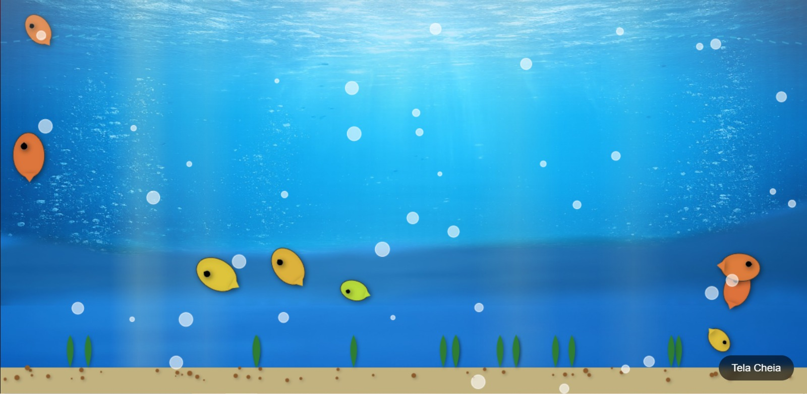

Uma aquário digital, que simula um micro oceano, com som aprazível de bolhas, para efeito de relaxamento.

 

## Funcionalidades

- Simulação de um aquário com animações em tempo real.
- Peixes com movimento dinâmico.
- Sistema de bolhas animadas.
- Efeitos visuais de água, luz e cenário.
- Loop de renderização contínuo.
- Estrutura modular com engine própria.
- Sons de bolhas para maior imersão.


## Requisitos

- Não requer instalação de depêndencias externas.

## Instalação

1. Clone o repositório:
   ```cmd
   git clone https://github.com/lk-desenvolvedor/aquario.git
   cd aquario